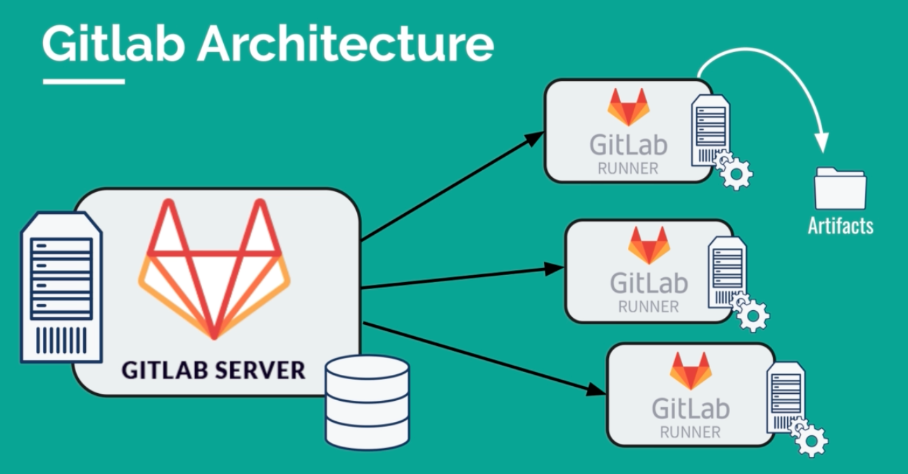
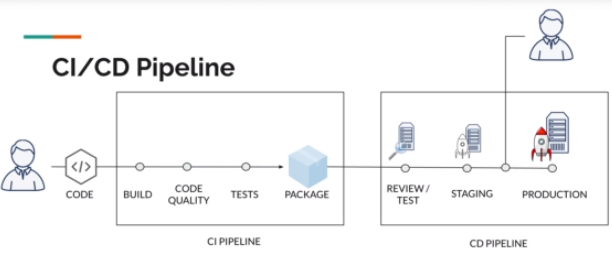

# GitLab CI: Pipelines, CI/CD and DevOps for Beginners

[View Course Notes](./assets/course-notes.pdf)

## Why Gitlab CI

- Simple, Scalable architecture
- Docker first approach
- Pipeline as code
- Merge request with CI support



## What is CI/CD?



### CI => continuous integration

- Practice are continously integrating code changes
- Ensure that the project **can stil be built / compiled**
- Ensure that any changes **pass all test**, guidelines, and code compliance standards

**Advantage**:
- Error are detected early in the development process
- Reduce integration problems
- Allows developers to work faster

### CD => Continous Delivery

- Ensure that the software can be **deployed anytime** to production
- Commonly the latest version is **deployed to a testing or staging system** 

**Advantage**:
- **Ensure the every change is releasable** by testing that it can be deployed
- **Redure risk** of a new deployment
- **Delivers value** much vaster

## Gitlab CI Fundamentals

### Predefine Environment Variables

Predefined CI/CD variables are available in every GitLab CI/CD pipeline. For example, this variable has been provided by gitlab: `CI_COMMIT_SHA`, `CI_COMMIT_TAG`, `CI_COMMIT_TITTLE`

More about [variable references](https://docs.gitlab.com/ee/ci/variables/predefined_variables.html)

### Optimize Pipeline using caches

- **Download dependencies** takes significant potion of the execution time
- "Traditional" CI servers like Jenkins do not delete the temporary data after the excetion finishes, resulting in a better execution time

**Common steps needed to run a job:**
- Delegate job to a Gitlab runner
- Download & start docker image
- Clone the repository
- Install any required dependencies
- Run the action step
- Save the result (if needed)

Example script add caches:

``` yaml
cache:
  key: ${CI_COMMIT_REF_SLUG}
  paths:
    - node_modules/
```

**Note**: 

- Define cache can be devine globally like this example or it can be staged
- The key can be filled according to preference, it can be a branch name, or something else

**Cache vs Artifact**

Artifact:

- An artifact usually the output of a build tool
- In Gitlab CI, artifacts are designed to save some compiled/generated part of the build
- Artifacts can be used to pass data between stages/jobs

Caches:

- Caches are not to be used to store build results
- Caches should only be used as a temporary storage for project dependencies

### Environment

- Environment allow you to **control the continuous delivery/deployment process**
- Easily **track deployment**
- You will know exactly **what** was deployed and on **which** environment
- You will have a **full history** of your deployment

Example:

```yaml
build production:
  state: deploy production
  environment:
    name: production
    url: https://some-url.com
  scripts:
    # Some scripts
```

### Defining Variables

Example:

```yaml
variables:
    STAGING_DOMAIN: staging-domain.com
    PRODUCTION_DOMAIN: production.com

# Use variable
# ...
url: https://$STAGING_DOMAIN
```

### Manual Deployment

- Exposes a play button for the job in the GitLab UI, with the text Can be manually deployed to <environment>.
- Means the `deploy_prod` job is only triggered when the play button is selected.

Example

```yaml
deploy_prod:
  # ....
  when: manual
```

### Merge Request Using Branches

**Using Branches**:

- Avoid breaking the master
- Breaking the master branch is **costly** and should be avoided
- Ensure that CD is always possible
- Each feature/task/bugfix **could** be done on separete branch
- Once the work is done, tested and reviewed, it can be **merged back to master**

**Branching Models:**

- The most known strategy is using **GitFlow**
- You are free to use with model suits you best
- Just **avoid using only one branch**

Example:

```yaml
deploy_prod:
  # ....
  only:
   - master

deploy_dev:
  # ....
  only:
   - dev
```

### Dynamic Environment

- **Staging and Production** are for the master branch
- To deploy a branch to an environment, we also need another environment (let's call this environment review)
- As we actually work with multiple branches at a time, we need to **dynamically create environments for each branch**
- As each merge request/branch is deployed to an environment, we can easly **review the chanes made**
- Sometimes it makes sense to **run additional tests** on a system that was deployed
- **Chanegs can be reviewed by non-developers** as well (Testers, Product Owners/Project Managers, Domain Experts and so on)

Example:

```yaml
deploy_review:
  # ....
  only:
    - merge_requests
  environment:
    name: review/$CI_COMMIT_REF_NAME
    url: https://instranceone-$CI_ENVIRONMENT_SLUG.com
  scripts:
    # ...
```

### Destory Environment

Example:

```yaml
stop review:
  stage: deploy review
  only:
    - merge_requests
  variables:
    GIT_STRATEGY: none
  # ....  
  when: manual
  environment:
    name: review/$CI_COMMIT_REF_NAME
    action: stop

# ....
deploy review:
  # ....
  environment:
      name: review/$CI_COMMIT_REF_NAME
      url: https://instazone-$CI_ENVIRONMENT_SLUG.surge.sh
      on_stop: stop review # Add this
```

### Before Script & After Script

`before_script`:

- Used to defined commands / scripts that should run **before** the normal script block
- before_script can be used **globally or locally** whithin a specific job

`after_script`:

- The local working directory has been set back to **default**
- Commands are executed in a **separate context** from before_script and script scripts

Example:

```yaml
deploy_prod:
  # ...
  before_script:
   - run a script here
  scripts:
   # ....
  after_script:
   - run a script here
```

More info [go to documentation](https://docs.gitlab.com/ee/ci/yaml/#before_script-and-after_script)


#### YAML Anchor

There are 2 parts to this:

- The anchor `&`which defines a chunk of configuration
- The alias `*` used to refer to that chunk elsewhere

Example:

```yaml
person:
  name: &name Jane
  self: *name
```

[More info about anchors](https://support.atlassian.com/bitbucket-cloud/docs/yaml-anchors/)

## References

- https://www.udemy.com/course/gitlab-ci-pipelines-ci-cd-and-devops-for-beginners
- https://support.atlassian.com/bitbucket-cloud/docs/yaml-anchors/